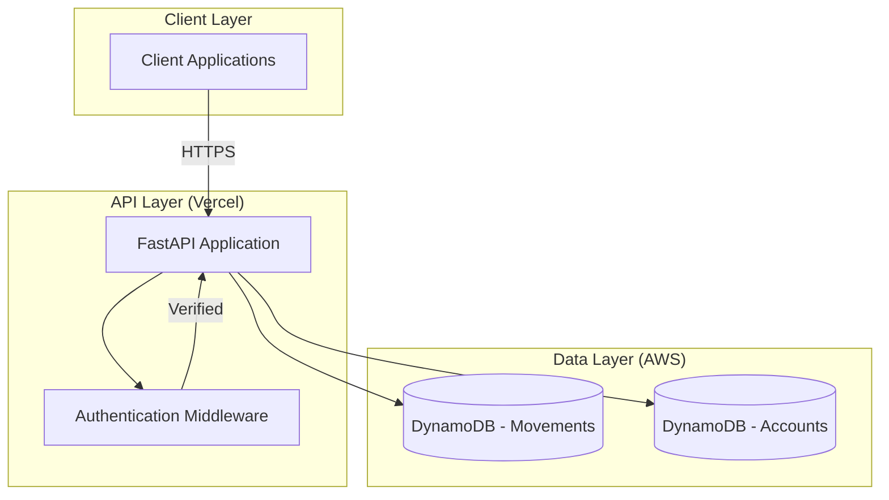
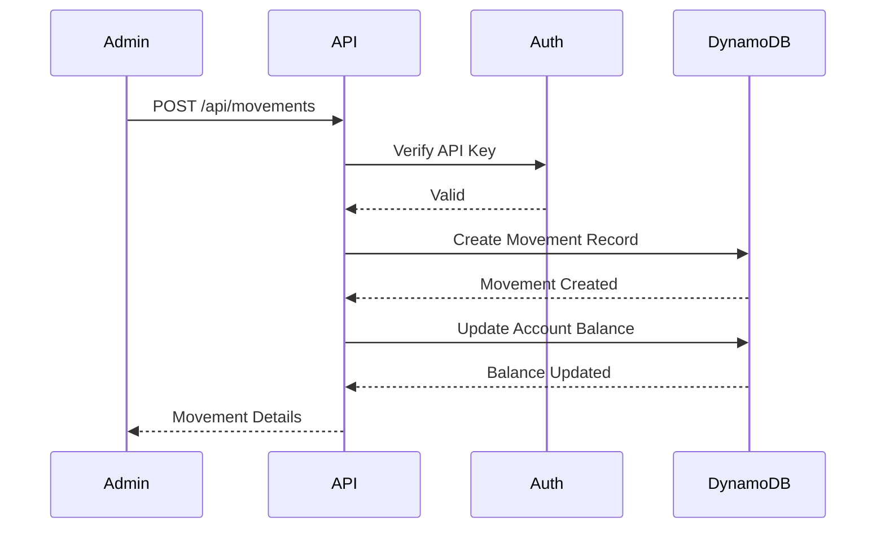
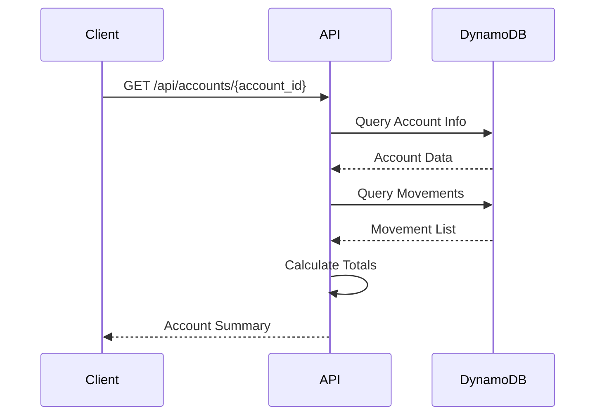
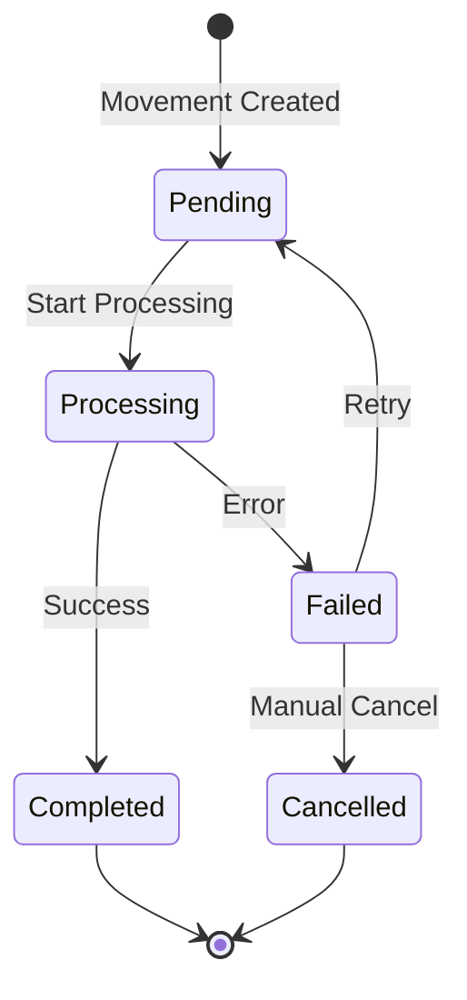
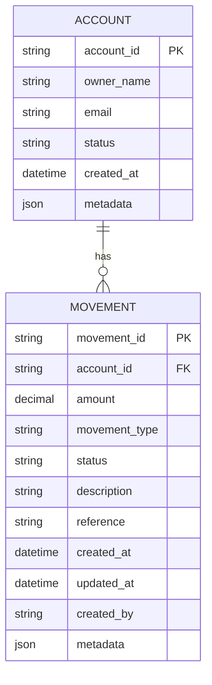

# Collaborative Funding Financial Movements System

A FastAPI-based system for handling financial movements in collaborative funding, with admin-managed contributions and client account status tracking.

## Architecture Overview



## System Flows

### 1. Admin Creates Movement Flow



### 2. Client Views Account Summary Flow



### 3. Movement Types State Diagram



## Data Model



## Features

- ✅ Admin management of contributions
- ✅ Client account status and totals tracking
- ✅ AWS DynamoDB integration for data persistence
- ✅ FastAPI REST API
- ✅ Vercel deployment ready
- ✅ API key authentication
- ✅ Real-time balance calculation

## API Endpoints

| Method | Endpoint | Description | Auth Required |
|--------|----------|-------------|---------------|
| GET | `/` | Health check | No |
| POST | `/api/movements` | Create a new financial movement | Yes (API Key) |
| GET | `/api/movements/{account_id}` | Get movements for an account | No |
| GET | `/api/accounts/{account_id}` | Get account summary | No |
| GET | `/api/accounts/{account_id}/balance` | Get current balance | No |

## Prerequisites

- Python 3.9+
- AWS Account with DynamoDB access
- Vercel account for deployment

## Installation

1. Clone the repository
2. Create a virtual environment:
   ```bash
   python -m venv venv
   source venv/bin/activate  # On Windows: venv\Scripts\activate
   ```
3. Install dependencies:
   ```bash
   pip install -r requirements.txt
   ```

## Configuration

Create a `.env` file with the following variables:

```
AWS_ACCESS_KEY_ID=your_access_key
AWS_SECRET_ACCESS_KEY=your_secret_key
AWS_REGION=us-east-1
DYNAMODB_TABLE_MOVEMENTS=financial_movements
DYNAMODB_TABLE_ACCOUNTS=accounts
API_KEY=your_secure_api_key
```

## Setting Up AWS Infrastructure

Run the table creation script:

```bash
python scripts/create_tables.py
```

## Local Development

```bash
uvicorn api.index:app --reload --port 8000
```

Visit http://localhost:8000/docs for the interactive API documentation.

## Testing

```bash
# Create a movement (requires API key)
curl -X POST http://localhost:8000/api/movements \
  -H "Content-Type: application/json" \
  -H "X-API-Key: your_api_key" \
  -d '{
    "account_id": "user123",
    "amount": 100.50,
    "movement_type": "contribution",
    "description": "Monthly contribution"
  }'

# Get account summary
curl http://localhost:8000/api/accounts/user123
```

## Deployment to Vercel

1. Install Vercel CLI:
   ```bash
   npm i -g vercel
   ```

2. Set up environment variables in Vercel:
   ```bash
   vercel env add AWS_ACCESS_KEY_ID
   vercel env add AWS_SECRET_ACCESS_KEY
   vercel env add AWS_REGION
   vercel env add DYNAMODB_TABLE_MOVEMENTS
   vercel env add DYNAMODB_TABLE_ACCOUNTS
   vercel env add API_KEY
   ```

3. Deploy:
   ```bash
   vercel --prod
   ```

## Project Structure

```
shaker/
├── api/
│   ├── __init__.py
│   ├── index.py         # Main FastAPI application
│   ├── models.py        # Pydantic models
│   ├── database.py      # DynamoDB client
│   └── auth.py          # Authentication logic
├── scripts/
│   └── create_tables.py # DynamoDB table setup
├── .env.example
├── .gitignore
├── requirements.txt
├── vercel.json
└── README.md
```

## Security Considerations

- API keys should be rotated regularly
- Use HTTPS in production
- Consider implementing rate limiting
- Add request validation and sanitization
- Implement proper logging and monitoring

## Future Enhancements

- [ ] User authentication system
- [ ] WebSocket support for real-time updates
- [ ] Batch movement processing
- [ ] Export functionality (CSV, PDF)
- [ ] Webhook notifications
- [ ] Multi-currency support